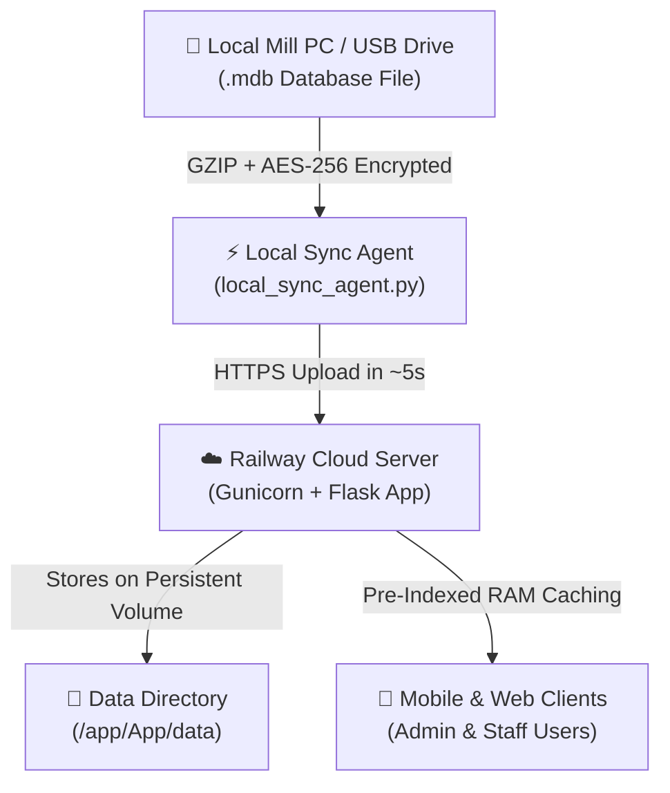

# 🌾 Rice Mill Dashboard — Client Deployment & First-Time Setup Guide

This document outlines the complete workflow for deploying, configuring, and hand-off of the **Rice Mill Dashboard Solution** for a new client.

---

## 🏗 System Architecture Overview



---

## 📋 Step-by-Step Client Onboarding Procedure

### Step 1: Deploy Client Cloud Server on Railway (~3 minutes)

1. **Deploy Repository**:
   - Go to [Railway.app](https://railway.app) → Click **+ New Project** → **Deploy from GitHub repo**.
   - Select the `Rice-Mill-Dashboard` repository.

2. **Attach Persistent Storage Volume**:
   - Click **+ Create** → Select **Volume**.
   - Click **Attach to Service** → Select `Rice-Mill-Dashboard`.
   - Set **Mount Path** to:
     ```text
     /app/App/data
     ```

3. **Configure Environment Variables**:
   - Go to the **Variables** tab on Railway and add the following:
     | Variable Key | Suggested Value | Description |
     | :--- | :--- | :--- |
     | `SYNC_SECRET_TOKEN` | `ClientNameToken2026!` | Secret authorization token for local sync agent |
     | `ENCRYPTION_KEY` | `ClientNameEncryptionKey2026!` | AES-256 master key for database encryption |
     | `ENABLE_AUTH` | `True` | Enforces login system on cloud |
     | `ADMIN_PASSWORD` | `ClientAdmin2026` | Admin account password |
     | `STAFF_PASSWORD` | `ClientStaff2026` | Default staff account password |
     | `SHOW_STOCKS` | `True` or `False` | Feature flag for stock visibility |
     | `SHOW_BI_REPORTS` | `True` or `False` | Feature flag for BI reports visibility |

4. **Copy Cloud URL**:
   - Go to **Settings** → **Networking** → Copy generated domain (e.g. `https://client-name.up.railway.app`).

---

### Step 2: Configure Client Mill PC (~2 minutes)

1. **Copy Client Folder**:
   - Copy the `Rice Mill Dashboard` folder onto the client's Windows PC at the mill (e.g. `C:\Rice Mill Dashboard\`).

2. **Edit `sync_config.txt`**:
   - Open `C:\Rice Mill Dashboard\sync_config.txt` in Notepad:
     ```ini
     # Path to database file on local disk or USB drive
     MDB_PATH = D:\SGRI\Data\SGRI 2025-2026.mdb

     # Railway Cloud URL
     CLOUD_URL = https://client-name.up.railway.app

     # Must match Railway SYNC_SECRET_TOKEN
     SYNC_SECRET_TOKEN = ClientNameToken2026!

     # Must match Railway ENCRYPTION_KEY
     ENCRYPTION_KEY = ClientNameEncryptionKey2026!

     # Sync Mode
     SYNC_MODE = AUTO
     CHECK_INTERVAL_SEC = 30
     ```

3. **Perform Initial Test Sync**:
   - Double-click **`sync_now.bat`**.
   - The script will read the local database, compress it (saved ~75% size), encrypt with AES-256, and upload to Railway in **~5 seconds**.

---

### Step 3: Enable Automated Background Sync on Windows Startup (~1 minute)

To ensure the client's database auto-syncs silently without user intervention:

1. Press `Win + R` on the mill PC keyboard.
2. Type **`shell:startup`** and press **Enter** (opens Windows Startup folder).
3. Right-click **`start_sync_agent.bat`** in `C:\Rice Mill Dashboard\` → Select **Create shortcut**.
4. Drag and drop the shortcut into the Windows Startup folder.

> 💡 **Result**: Whenever the mill PC powers on or a USB drive is inserted/saved, the background agent detects changes and auto-syncs the cloud server within 5 seconds.

---

### Step 4: Client Hand-Off & Mobile Setup (~2 minutes)

1. **Access Web App**:
   - Open `https://client-name.up.railway.app` on client's smartphone, tablet, or PC browser.

2. **Log In**:
   - **Username**: `admin`
   - **Password**: `ClientAdmin2026` (or set value)

3. **User Management**:
   - Admin can navigate to **Settings / Users** inside the dashboard to create staff accounts or change passwords anytime.

---

## 🔒 Security & Performance Summary for Clients

- **End-to-End Encryption**: Data is compressed via GZIP and encrypted with AES-256 Fernet encryption before leaving the local PC.
- **Ultra-Fast Speed**: Upload takes **5 seconds** over standard internet connections.
- **Cloud Performance**: Server pre-indexes database queries into RAM memory, serving mobile page requests in **< 50ms**.
- **Data Privacy**: No unencrypted data is ever exposed publicly on cloud endpoints.
